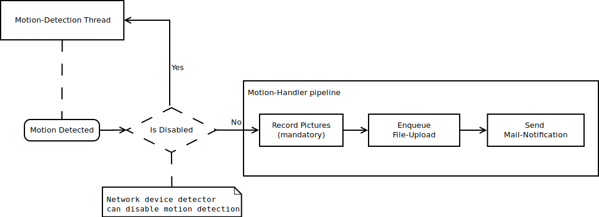

============
Introduction
============

The main idea behind ``camguard`` was to create a home surveillance system, which doesn't require to be accessed via internet. An optional upload to a online storage should be the only way the system uses, *but not provides*, online services.

Components
==========
``camguard`` provides a motion handler pipeline, by using a configured set of components:

    Motion detection flow with handler pipe

For further explanation about component configuration please refer to :doc:`config`.

Motion detector
---------------
Runs the motion detection thread and calls handler pipeline if motion is detected by the sensor.

Motion handler
--------------
Represents the Raspberry Pi camera component. Recording pictures by the camera is the first step in the motion handling pipeline. The recorded data will then be pushed through the pipeline to other (optional) components.

File storage
------------
*Optional* file storage component, which enqueues recorded files for asynchronous upload.

Mail client
-----------
*Optional* mail client component, which sends mail notifications when motion was detected.

Network device detector
-----------------------
*Optional* network device detector thread, which checks for certain devices on the network and disables motion handler pipeline when discovered.
