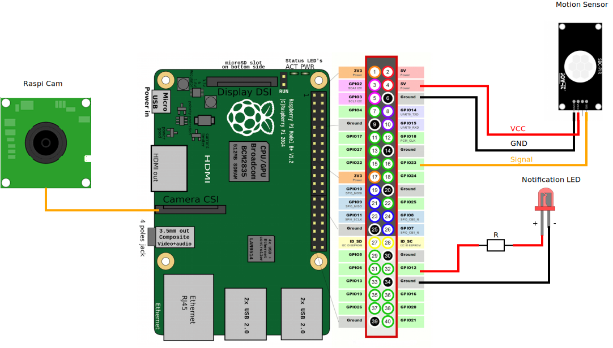
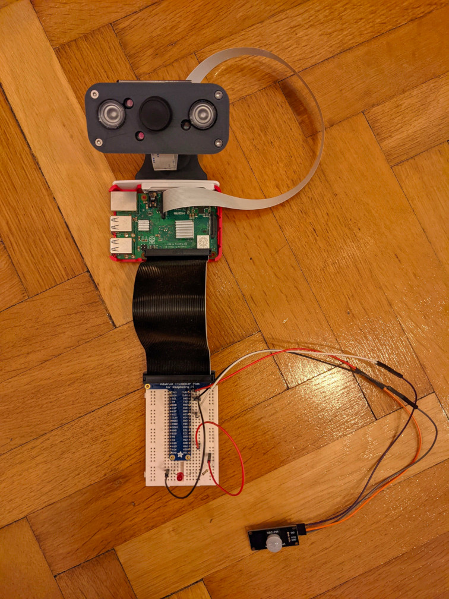

===========
Raspi-Setup
===========

Hardware setup on Raspberry Pi requires the following equipment:
    - Joy-IT SBC-PIR BIS0001 Motion Sensor
    - Raspi-Cam Electreeks E-RS015
    - Raspi-Cam Case Electreeks Komplex I
    - 1m/2m Electreeks FFC Ribbon-Cable AWM 20624 80C 60V VW-1
    - Red notification LED with current limiting resistor (optional)
    - Raspi T-Cobbler (optional)

⚠️ Be careful not to use a HC-SR501 Motion Sensor, it can be really hard to adjust the re-triggering on this sensor. Make your life easy by using SBC-PIR BIS0001 or similar.

Schematics
----------

Picture of the setup
----------------------------

